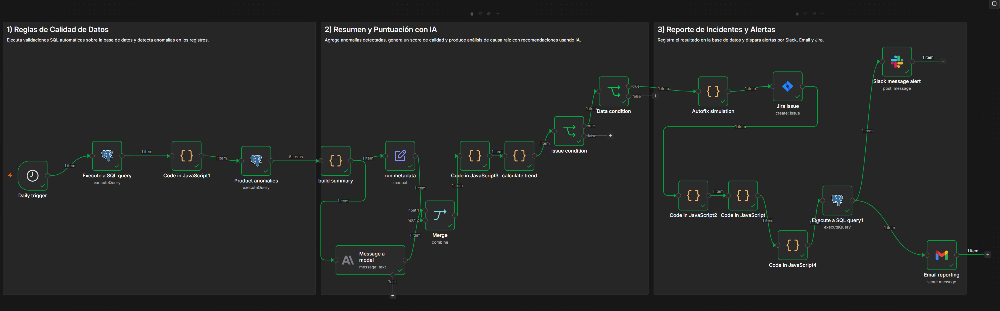
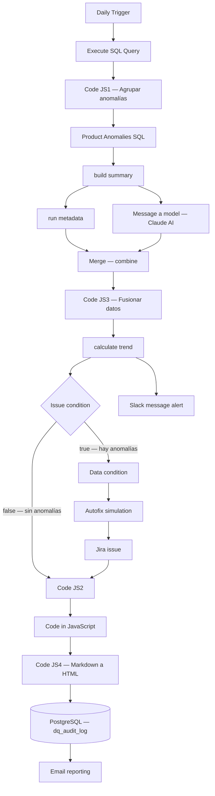

# Pipeline de Monitoreo de Calidad de Datos 

Plataforma automatizada de monitoreo y calidad de datos que valida registros en PostgreSQL, genera análisis con IA, y dispara alertas multicanal vía Slack, Email y Jira. Simula una arquitectura de DataOps real para supervisión continua de calidad en redes de concesionarios.


> Pipeline de calidad de datos de extremo a extremo: validaciones SQL automáticas → scoring con IA → registro en auditoría → alertas por Slack, Email y Jira. Cero intervención manual.

---

## Arquitectura del Sistema


---

## Vista General del Workflow



---

## Ejemplo de Reporte Email


---

## Problema de Negocio

Una red de concesionarios Honda no contaba con un sistema automatizado de monitoreo de calidad de datos. Los analistas revisaban manualmente la integridad de los registros de forma periódica, sin visibilidad en tiempo real sobre anomalías, duplicados o inconsistencias en los datos operativos.

| Punto de Dolor | Impacto |
|---|---|
| Revisión manual de calidad | Horas de analista por ciclo |
| Sin alertas tempranas | Anomalías detectadas días después |
| Sin historial de calidad | Imposible medir tendencias o degradación |
| Escalación manual de incidentes | Retraso en resolución de problemas críticos |

---

## Solución

| Paso | Herramienta | Acción |
|---|---|---|
| Disparador | Daily Trigger (n8n) | Ejecución automática diaria del pipeline |
| Extraer | PostgreSQL | Consulta SQL de reglas de validación configurables |
| Transformar | JavaScript Code | Agregación de anomalías, cálculo de score 0–100 |
| Analizar | Claude AI (Anthropic) | Análisis de causa raíz y recomendaciones automáticas |
| Registrar | PostgreSQL | INSERT en tabla de auditoría `dq_audit_log` |
| Alertar | Slack | Mensaje con score, anomalías y análisis AI |
| Escalar | Jira | Creación automática de ticket si hay anomalías críticas |
| Reportar | Gmail | Email HTML con reporte completo formateado |

---

## Arquitectura



---

## Stack Tecnológico

| Capa | Tecnología |
|---|---|
| Orquestación | n8n (auto-hospedado) |
| Validación | PostgreSQL 15 |
| Transformación | JavaScript |
| IA | Claude AI — Anthropic |
| Alertas | Slack API |
| Incidentes | Jira REST API |
| Reportes | Gmail API |
| Infraestructura | Docker Compose |

---

## Esquema de Base de Datos

| Objeto | Tipo | Descripción |
|---|---|---|
| `sales_orders` | Hecho | Registros de ventas por transacción |
| `dq_audit_log` | Auditoría | Cada ejecución registrada con score, anomalías y estado |

### Tabla de Auditoría `dq_audit_log`

```sql
CREATE TABLE public.dq_audit_log (
    id            SERIAL PRIMARY KEY,
    check_name    TEXT,
    table_name    TEXT,
    severity      TEXT,
    rows_affected INTEGER,
    score         INTEGER,
    detail        TEXT,
    status        TEXT,
    created_at    TIMESTAMP DEFAULT NOW()
);
```

---

## Flujo de Alertas

| Score | Estado | Acciones |
|---|---|---|
| 90–100 | ✅ Óptimo | Email + Slack informativos |
| 70–89 | ⚠️ Advertencia | Email + Slack con recomendaciones |
| < 70 | 🚨 Crítico | Email + Slack urgente + Ticket Jira |

---

## Resultados

| Métrica | Antes | Después |
|---|---|---|
| Tiempo de detección de anomalías | Días | **< 1 hora** |
| Intervención manual por ciclo | ~2 horas | **0 horas** |
| Historial de calidad disponible | No | **Sí — auditoría completa** |
| Escalación de incidentes | Manual | **Automática vía Jira** |
| Visibilidad ejecutiva | Nula | **Email + Slack diario** |

---

## Hoja de Ruta

| Prioridad | Funcionalidad |
|---|---|
| P1 | Dashboard de tendencias de calidad en Power BI sobre `dq_audit_log` |
| P1 | Umbrales de score configurables por tabla o regla |
| P2 | Soporte multi-tenant (múltiples redes de concesionarios) |
| P2 | Despliegue en la nube (GCP + Cloud SQL) |
| P3 | Integración con dbt para capa de transformación |
